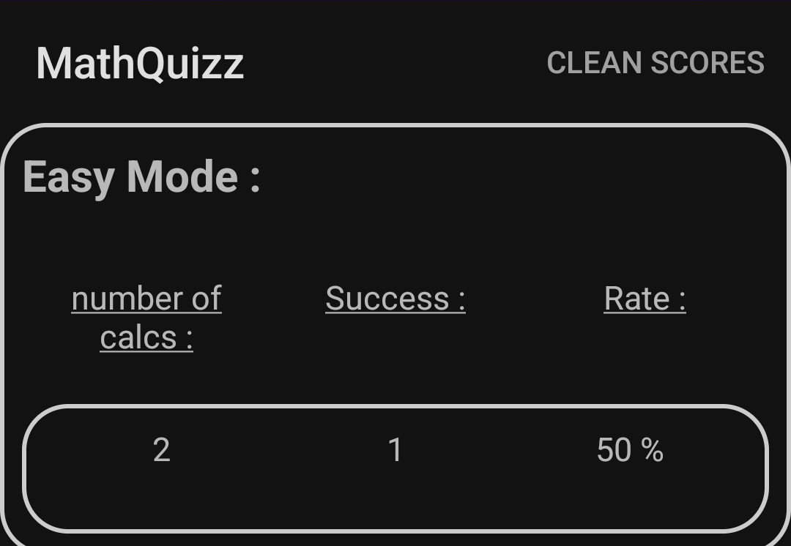

# MathQuizz - Android App


MathQuizz is an Android application designed to train mental arithmetic skills through a gamified interface. It offers multiple difficulty levels and tracks user performance with a lives system and session statistics.

## 📱 Screenshots

<p float="left">
  
   
  
  
  
</p>

## ✨ Features

* **3 Difficulty Levels:** Easy, Medium, and Difficult modes to suit different skill levels.
* **Lives System:** The player starts with 3 hearts. Wrong answers reduce the life count.
* **Instant Feedback:** Visual cues (Green/Red screens) indicate correct or incorrect answers immediately.
* **Session Statistics:** Displays the total number of calculations, success count, and success rate (%) at the end of a session.
* **Streak Counter:** Tracks consecutive correct answers.

## 🛠️ Technical Requirements

* **Android Studio:** Required to open and build the project.
* **Android SDK:** API Level 21+ (Lollipop) recommended.
* **Language:** Java.

## 📦 Installation

1.  **Clone the repository:**
    ```bash
    git clone https://github.com/JustinF02/MathQuizz.git
    ```
2.  **Open in Android Studio:**
    * Launch Android Studio.
    * Select "Open an existing Android Studio project".
    * Navigate to the cloned folder.
3.  **Build and Run:**
    * Connect an Android device or start an Emulator.
    * Click the **Run** (Green Play) button.

## 👤 Author

* **JustinF02** - *Lead Developer*